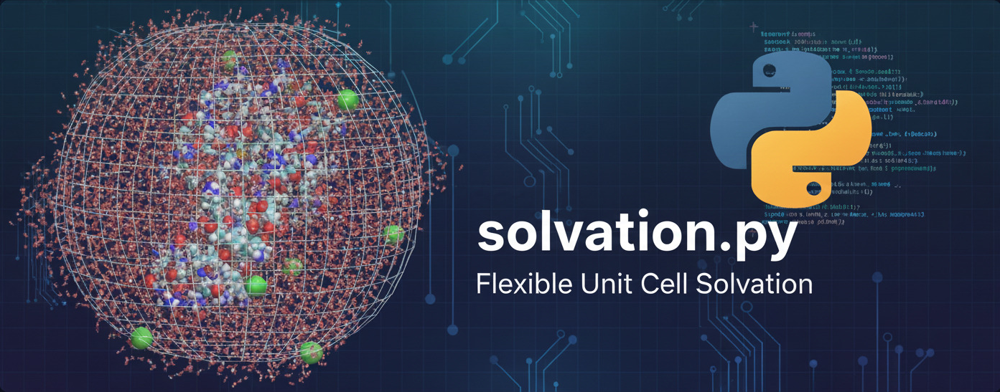

# solvation.py — Solvation tool for flexible unit cells

Create a solvated surface/unit cell for non-orthogonal/crystal unit cells using Packmol + OpenBabel, then filter solvent by distance and unit-cell mass fraction.

**Author:** Stijn De Vos (stevnBasbak) — Computational researcher at VUB

---


<p align="center">
  
</p>


## Summary

`surface_solvate.py` is a Python utility that builds a solvated surface for *crooked* (non-orthogonal) unit cells. It:

* generates a tight-fitting cuboid solvent box that covers the unit cell,
* populates that box with one or up to three solvent types + optional solute/ion using **Packmol**,
* removes solvent molecules closer than a user-defined distance from the surface,
* removes molecules whose mass fraction inside the unit cell is below a user-defined cutoff,
* merges the filtered solvent and the surface and writes a final solvated PDB with the original CRYST1 line preserved.

The script is designed to be lightweight and reproducible: all intermediate work is done in `./temp_workfolder` and the final result is moved to the parent directory as `<surface_basename>_solvated.pdb`.

---

## Highlights / Features

* Works with arbitrary lattice parameters (reads `CRYST1` from the surface PDB).
* Automatic cuboid solvent box generation computed from lattice vectors.
* Supports up to 3 solvent types and optional solute + cation species.
* Uses Packmol for packing — flexible box constraints.
* Eliminates overlapping solvent molecules using distance thresholding and molecule connectivity (`CONECT`).
* Removes molecules mostly outside the unit cell based on mass fraction.
* Uses OpenBabel/Pybel to merge final structures and preserve PDB formatting.

---

## Requirements

* Python 3.8+ (tested with 3.8–3.11)
* `numpy`
* `scipy` (for spatial KD-tree)
* `openbabel` / `pybel` (OpenBabel Python bindings)
* `packmol` (external executable in your `PATH`)
* Optional utilities: `networkx` (the script checks for it, optional depending on usage)

Recommended install (conda environment):

```bash
conda create -n surf_solv python=3.10 -y
conda activate surf_solv
conda install -c conda-forge numpy scipy openbabel packmol pybel -y
# If packmol is not available via your channels, compile from source and add to PATH
```

If you prefer `pip` for pure Python packages:

```bash
pip install numpy scipy networkx
# For OpenBabel bindings on pip, follow your OS/distribution instructions or use conda-forge
```

**Important**: `packmol` is an external program — compile or install it and ensure `packmol` is available on your PATH. The script will abort if `packmol` cannot be found.

---

## Quick run

Place the following in the repository (or working dir) before running:

* `surface_pdb` — your surface PDB file that includes a `CRYST1` line.
* solvent PDB molecule files (e.g., `water.pdb`, `PC.pdb`, `DMC_molecule.pdb`).
* optional solute/ion PDBs.

Then edit the top of `surface_solvate.py` to set the variables (or adapt the script to parse a configuration or CLI) and run:

```bash
python surface_solvate.py
```

The script will create a temporary working directory `./temp_workfolder` and remove it at the end. The final output is written as `<surface_basename>_solvated.pdb` in the parent directory.

---

## Input variables (top of script)

The script is configured by variables at the top. Key inputs:

* `surface_pdb` (str) — surface PDB file (must contain a `CRYST1` line).
* `solvent_molecule` (str) — PDB file with a single solvent molecule (required if `fraction_solvent_1 > 0`).
* `density`, `molar_mass` — density (g/mL) and molar mass (g/mol) for solvent 1.
* `fraction_solvent_1` (float, 0–1) — molar fraction of solvent 1. Sum of fractions (1,2,3) must equal `1`.
* `distance_threshold` (float, Å) — remove solvent molecules with **any atom** closer than this distance to a surface atom (recommended around `0.95–1.2` Å depending on system and force field).
* `mass_threshold` (float, percent) — allowed percentage of a molecule's mass outside the unit cell before it is discarded (0–100).
* Optional solute / solute cation settings and up to two extra solvents (`solvent_molecule_2`, `solvent_molecule_3`, etc.).

**Notes:** The script assumes PDB `HETATM` records for solvent molecules and uses `CONECT` records to determine molecule membership. If your solvent PDBs don't include `CONECT` records, Packmol's output may still provide connectivity depending on your molecule formatting; otherwise, molecule grouping could require supplementation.

---

## What the script does (step-by-step)

1. Validate inputs and required external programs (Packmol, OpenBabel bindings).
2. Create `./temp_workfolder` and copy inputs into it.
3. Read `CRYST1` to extract unit cell parameters (`a,b,c,alpha,beta,gamma`).
4. Construct lattice vectors and compute a **minimal cuboid** that fully contains the unit cell.
5. Estimate the number of solvent/solute molecules from box volume, solvent densities and molar masses.
6. Generate a `Packmol` input file and run `packmol` to make `solvent_box.pdb`.
7. Clean `CONECT` formatting and use the `CONECT` graphs to find connected atoms belonging to the same molecule.
8. Remove solvent molecules having any atom closer than `distance_threshold` Å to any surface atom (with periodic minimum-image distance handling using the unit cell).
9. Remove solvent molecules whose mass fraction inside the unit cell is below the `mass_threshold`.
10. Merge filtered solvent and surface PDB using OpenBabel/Pybel, insert `CRYST1` if missing, write final `<surface_basename>_solvated.pdb`, move it to parent directory, and clean up `./temp_workfolder`.

---

## Output

* `<surface_basename>_solvated.pdb` — final solvated system with CRYST1 line preserved (moved to parent directory).
* Intermediate files generated in `./temp_workfolder` during the run. The script deletes the temp folder upon successful completion.

---

## Tips, caveats and troubleshooting

* **CRYST1 required**: The surface PDB **must** contain a valid `CRYST1` line. The script exits if `CRYST1` is missing.
* **Packmol failures**: If Packmol fails, re-run with `show_output=True` in `run_packmol()` or manually run `packmol < input.inp` to see the error messages.
* **Connectivity / CONECT**: The script relies on `CONECT` records to identify molecules. If your solvent PDBs don't include `CONECT`, use a consistent PDB generator that provides them or add them via OpenBabel. Molecule grouping without CONECT may be less robust.
* **Mass dictionary**: The atomic mass dictionary is included for common elements; extend `ATOMIC_MASSES` if you use unusual atoms.
* **Unit consistency**: Coordinates are assumed to be in Å, densities in g/mL, mass in g/mol, and the distance threshold in Å.
* **Unit-cell periodicity**: Distances are computed using the minimum-image convention using the `a,b,c` box lengths — this is appropriate for lattice-vector computed cuboids but check carefully for systems with substantial skew.
* **Fraction sums**: The script asserts that `fraction_solvent_1 + fraction_solvent_2 + fraction_solvent_3 == 1.0`.

---

## License & Contact

Author: **Stijn De Vos** (stevnBasbak) — Computational researcher at VUB
Email: `Stijn.De.Vos@vub.be`

---
